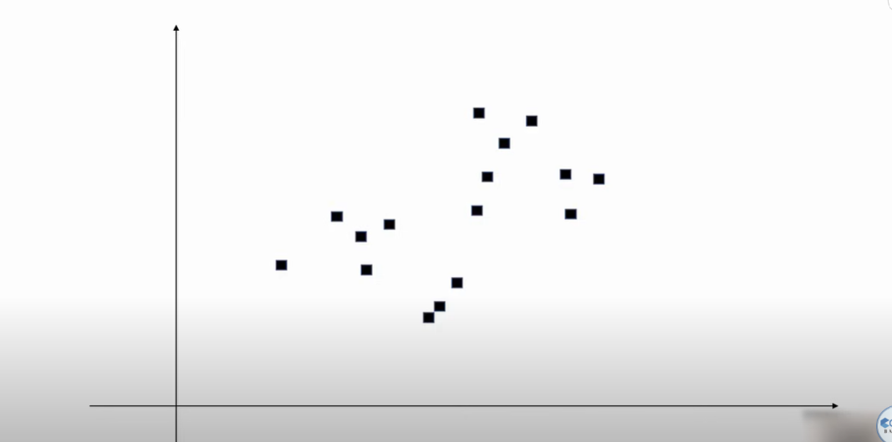

It is unsupervised learning algorithm jisme sirf features provide hote hai, target predict nhi krna hota kuki target hote hi nhi hai  
Instead isme similar points ko group krke clusters banana hota hai  

Like suppose ye data hai 

Ab isme apan k groups banaege , and k is parameter means apa ko khud decide krna hai ki kitne groups banane hai
1. Here k=2
   
2. Here k=6
   

## How to identify ki kitne clusters banane hai?
1. Toh tum pehle 2 cluster banao and unke centroid se sabka distance nikaalo
   
2. Phir tum 3 cluster banao and unke centroid se sabka distance nikaalo
3. and so on esa krte jaao, ek time aaega ki jab number of clusters=number of points ho jaaega to sabka distance 0 ho jaaega
4. Toh graph kuch esa banega, jitne jyaad cluster, utna kam error, toh hum elbow poinit ko use krege yaha elbow 4 hai toh k=4 choose krege
   

