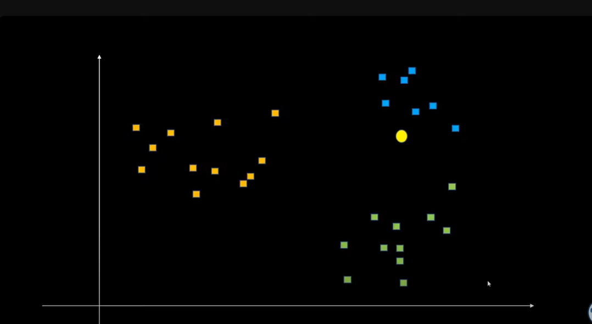
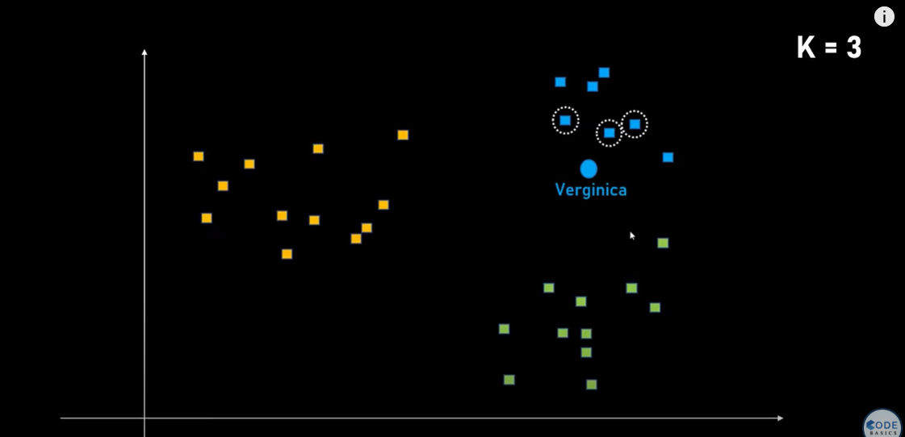
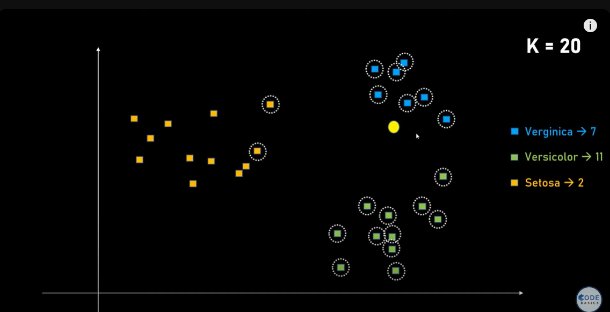

1. Suppose humareko clustering krni hai, given 3 clusters, we hve to find ki vo yellow dot konse cluster mai hai, it is common sense ki vo blue cluster mai hai

2. Now , suppose k=3 liya apan ne KNN mai, toh KNN 3 nearest neighbours nikaalega and un mai se voting kr vaaega ki kon kis cluster se hai, max vote jis cluster ke aaege voh us cluster mai daal dega. Like yaha teeno nearest neighbours blue se aaye toh isne blue mai daal dia which is correct

3. But if k=20, toh vo 20 nearest points de votes maangega jisme se 7 verginica ke hai and versicolor ke 11 votes and setosa ke 2 votes and voh usko versicolor mai daal dega, but actually it is verginica. Toh apan ko hyper parameter tuning/ k cross validation use krna padega to find the perfct value ok k
