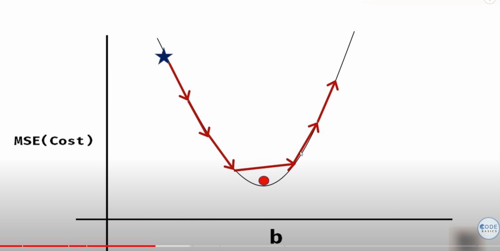
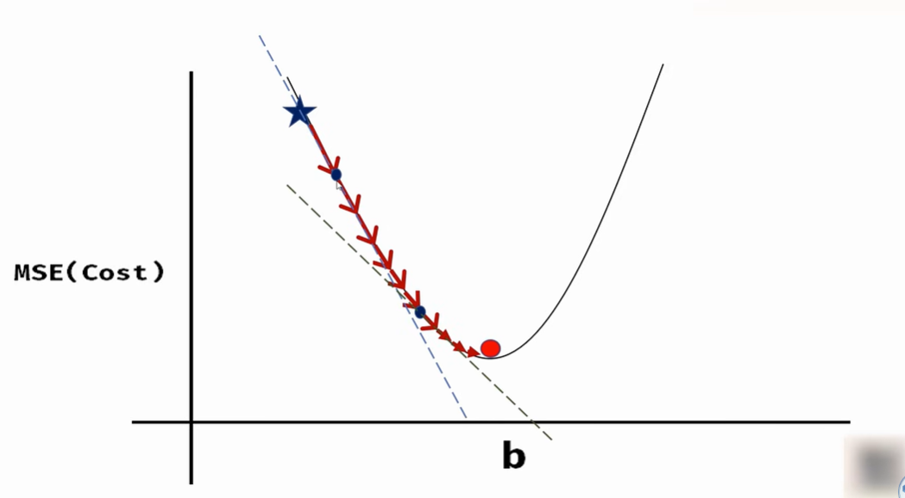

We have to find the best fit line for the linear regression-:
1. Brute force is that we take all possible combinations of m,c but that will be very ineffective as time complexity will be very high, because m,c can infinite values
2. So we start with any value and we have to reach the min of the bowl.

3. One way of doing this is, we take fixed steps , but usse maybe apan global minimum miss krde

4. We go to a point and hum us point ki slope dekhte hai ky hai , hum slope ke direction mai jaate hai, toh hume direction mil gya ab hume step chaiye.Toh hum learning rate(alpha) ko as a step lete hai
