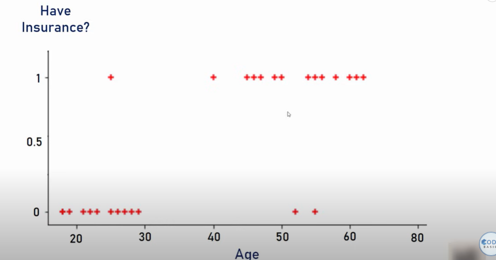

In linear regression , output is continous but in logistic output(predicted) value is discrete ,that is pridicted value is categorical  
Now this classification algorithm is of two type-:  
1) Binary Classification-: It has only 2 outputs
2) Multiclass Classification-: It has more than 2 outputs

### Suppose this is the scatter plot of the data, yaha linear relationship dikh hi ni rhi , yaha sirf 2 values output aa rhi hai

### If you use linear regression the line will be this, jo ki bilkul galat ans degi predicted values ka 

### So instead of this linear function , we use sigmoid function, which clearly fits the data points

### Sigmoid Function

### How to identify this function, what are the variables in Logistic Regression
In linear Regression we were having a line , but that line can be of any slope,intercept(m,b) so we use gradient descent to find the line which minimizes the mean square error  
Here also we do gradient descent to find the m,b of the sigmoid function, so the sigmoid function changes its shape accordingly

Toh jab Linear Regression model ko train krte hai toh model m,b ki values nikalta hai for line.
And jab Logistic Regression model ko train krte hai toh model m,b ki values nikalta hai for sigmoid function.

Jab ye values nikal jaati hai then model is called trained model, now we can test the model.
When we say model is trained means it has find the perfect value of variables(m,b here)

